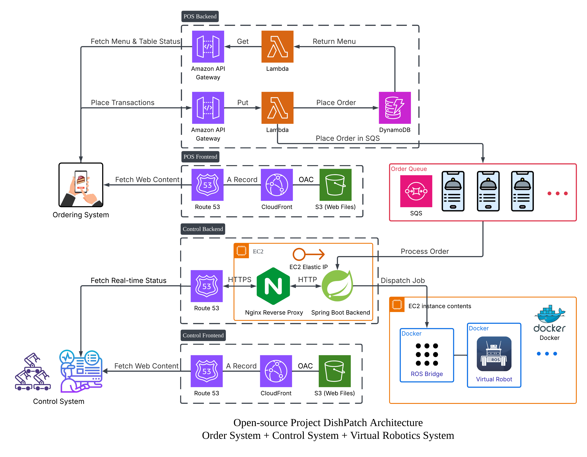
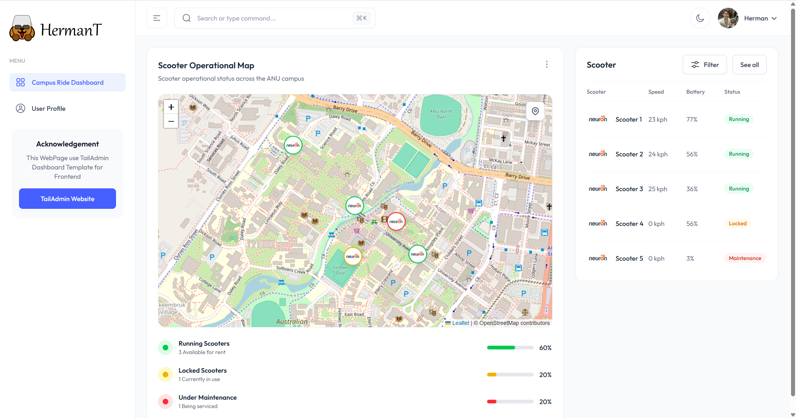

<!--  -->


# DishPatch
DishPatch is an open-source, AWS cloud-based restaurant service-robot platform that integrates ordering, dispatch/control, and robotics fleet execution.



## Overview
Service robots are increasingly adopted in restaurants and hotels. While commercial platforms (e.g., Yunji, Pudu) are mature and reliable, they are often expensive, closed-source, and difficult for individual developers to customise or extend.

DishPatch provides a modular architecture spanning:
- **Ordering System** — POS ordering and data storage
- **Control System** — monitoring, order processing, and job scheduling
- **Robotics Fleet** — fleet management, robot state streaming, and task execution

The project targets developers with foundational software/robotics experience who want to build, test, and iterate on a complete system—from simulation to real-world deployment.

## System Workflow
This diagram summarises the end-to-end workflow across ordering, dispatch/control, and robot fleet execution.


<p align="center">
  DishPatch basic workflow
</p>

**Step 1 — Order Placement**  
A customer places an order via the Ordering System. The order details are recorded and enqueued as a delivery job.

**Step 2 — Dispatch & Monitoring**  
The Control System consumes jobs from the queue, schedules delivery tasks for the robotics fleet, and provides a monitoring dashboard showing real-time robot status (e.g., location and battery).

**Step 3 — Fleet Execution**  
Robots receive high-level commands from the Control System and autonomously navigate to deliver dishes to the customer, then proceed to the next assigned task.

## Components

### (1) POS System 

<p align="center">
  Implementation: <strong>HTCafePOS</strong> ·
  <a href="https://pos.herman-tang.com/menu">Demo</a> ·
  <a href="https://github.com/DDQXZcp/HTCafePOS/">Repository</a>
</p>

The POS system provides a customer-facing ordering interface used to place orders and generate delivery tasks.

**POS Frontend (Web)**


<p align="center">
  HTCafePOS POS Frontend
</p>

The POS frontend is a React web application hosted on **Amazon S3** and delivered via **CloudFront** for global caching and low-latency access.

**POS Backend (Serverless APIs)**


The POS backend exposes APIs for menu/table queries and order submission. It uses **API Gateway + AWS Lambda** for request handling and **DynamoDB** for persistent storage.


**Initialize DynamoDB Menu**
```
cd pos-backend
node scripts/seedMenus.js
```

<!-- > Note: If this module is currently hosted in a different repo (e.g., CampusRide), replace the link above to keep naming consistent. -->

---

### (2) Control System 

<p align="center">
  Existing Work <strong>CampusRide</strong> — Personal POS Project ·
  <a href="https://campusride.herman-tang.com/">Demo</a> ·
  <a href="https://github.com/DDQXZcp/DishPatch/tree/main">Repository</a>
</p>

**Control Frontend (Operator Dashboard)**


The control system coordinates orders and fleet operations. It is intended to include:
- **Monitoring Dashboard** — real-time robot telemetry (location, heading, speed, battery)


<p align="center">
  CampusRide Frontend
</p>

**Control Backend (Dispatch & Orchestration)** 


- **Job Scheduler** — transforms orders into tasks and assigns delivery jobs
- **Fleet Manager** — manages high-level robot coordination and task execution


**Planned deliverables**
- REST APIs for orders, tasks, and fleet management
- real-time status streaming via WebSocket/MQTT
- scheduling strategies (FIFO, priority-based, zone-aware, load balancing)

---

### (3) Robotics System 

The robotics layer is responsible for executing delivery tasks and publishing robot state. 

Initial development will focus on a virtual/simulated environment to validate end-to-end behaviour. Support for physical robots will be introduced once the platform interfaces and workflows stabilise.

**Virtual Robot Fleet** 


- **Virtual Robot** — Each service robot runs in a Docker container with ROS 2 and simulation tooling (e.g., Gazebo, RViz2, Nav2). Robots subscribe to assigned jobs and autonomously navigate to perform dish delivery.
- **ROS Bridge** — A bridge component that converts ROS topics into WebSocket messages for communication with the control backend, enabling real-time telemetry streaming and command dispatch.

## Deployment & CI/CD
DishPatch is deployed on AWS via GitHub Actions. Deployments authenticate   to AWS using IAM OIDC (no stored AWS keys).
See [deployment.md](./docs/deployment.md) for details.

## Contributing
Contributions are welcome. Please see [CONTRIBUTING.md](./CONTRIBUTING.md) for guidelines.

<!-- 


 -->
