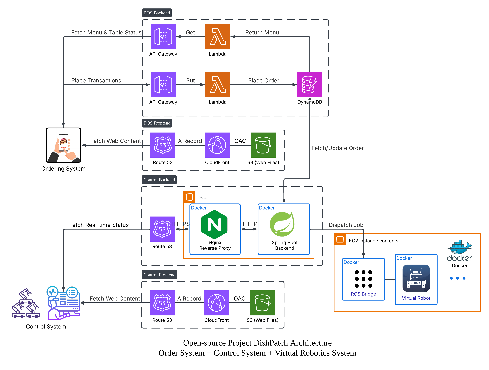
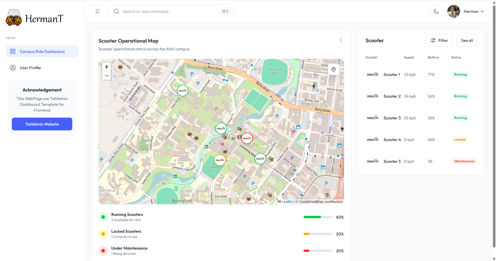

<!--  -->

# DishPatch

DishPatch is an open-source, AWS cloud-based restaurant service-robot platform that integrates ordering, dispatch/control, and robotics fleet execution.
<p align="center">
  <strong>POS System</strong> 
  <a href="https://pos.dish-patch.com/">Live Demo</a> |
  <strong>Control System</strong> 
  <a href="https://control.dish-patch.com/">Live Demo</a>
</p>



## Overview

Service robots are increasingly adopted in restaurants and hotels. While commercial platforms (e.g., Yunji, Pudu) are mature and reliable, they are often expensive, closed-source, and difficult for individual developers to customise or extend.

DishPatch provides a modular architecture spanning:

- **Ordering System** — POS ordering and data storage
- **Control System** — monitoring, order processing, and job scheduling
- **Robotics Fleet** — fleet management, robot state streaming, and task execution

The project targets developers with foundational software/robotics experience who want to build, test, and iterate on a complete system—from simulation to real-world deployment.

## System Workflow

This diagram summarises the end-to-end workflow across ordering, dispatch/control, and robot fleet execution.


<p align="center">
  DishPatch basic workflow
</p>

**Step 1 — Order Placement**  
A customer places an order via the Ordering System. The order details are recorded and enqueued as a delivery job.

**Step 2 — Dispatch & Monitoring**  
The Control System consumes jobs from the queue, schedules delivery tasks for the robotics fleet, and provides a monitoring dashboard showing real-time robot status (e.g., location and battery).

**Step 3 — Fleet Execution**  
Robots receive high-level commands from the Control System and autonomously navigate to deliver dishes to the customer, then proceed to the next assigned task.

## Components

### (1) POS System 

<p align="center">
  <strong>POS System</strong> 
  <a href="https://pos.dish-patch.com/">Live Demo</a>
</p>

The POS system provides a customer-facing ordering interface used to place orders and generate delivery tasks.

**POS Frontend (Web)**


<p align="center">
  DishPatch POS Frontend
</p>

The POS frontend is a React web application hosted on **Amazon S3** and delivered via **CloudFront** for global caching and low-latency access.

**POS Backend (Serverless APIs)**


The POS backend exposes APIs for menu/table queries and order submission. It uses **API Gateway + AWS Lambda** for request handling and **DynamoDB** for persistent storage.

<!-- > Note: If this module is currently hosted in a different repo (e.g., CampusRide), replace the link above to keep naming consistent. -->

---

### (2) Control System 

<p align="center">
  <strong>Control System</strong> 
  <a href="https://control.dish-patch.com/">Live Demo</a>
</p>

**Control Frontend (Operator Dashboard)**


The control system coordinates orders and fleet operations. It is intended to include:

- **Monitoring Dashboard** — real-time robot telemetry (location, heading, speed, battery)


<p align="center">
  CampusRide Frontend
</p>

**Control Backend (Dispatch & Orchestration)**


- **Job Scheduler** — transforms orders into tasks and assigns delivery jobs
- **Fleet Manager** — manages high-level robot coordination and task execution

**Planned deliverables**

- REST APIs for orders, tasks, and fleet management
- real-time status streaming via WebSocket/MQTT
- scheduling strategies (FIFO, priority-based, zone-aware, load balancing)

**Order States**

- created
- paid
- cancelled
- completed

<!-- For each order, it will have multiple items. For each item, it has its own states
- pending
- preparing
- ready
- delivering
- served
- cancelled -->

---

### (3) Robotics System 

The robotics layer is responsible for executing delivery tasks and publishing robot state.

Initial development will focus on a virtual/simulated environment to validate end-to-end behaviour. Support for physical robots will be introduced once the platform interfaces and workflows stabilise.

**Virtual Robot Fleet**


- **Virtual Robot** — Each service robot runs in a Docker container with ROS 2 and simulation tooling (e.g., Gazebo, RViz2, Nav2). Robots subscribe to assigned jobs and autonomously navigate to perform dish delivery.
- **ROS Bridge** — A bridge component that converts ROS topics into WebSocket messages for communication with the control backend, enabling real-time telemetry streaming and command dispatch.

## Deployment & CI/CD

DishPatch is deployed on AWS via GitHub Actions. Deployments authenticate to AWS using IAM OIDC (no stored AWS keys).
See [deployment.md](./docs/deployment.md) for details.

## Testing

The control backend has 152 tests across unit, integration and API levels, run on every pull request by
[test-control-backend.yml](./.github/workflows/test-control-backend.yml) and again before every deployment.

Measured fault detection, branch coverage, determinism and test-smell results are in
[control-backend-test-quality.md](./docs/control-backend-test-quality.md), along with the commands to
reproduce every figure.

## Contributing

Contributions are welcome. Please see [CONTRIBUTING.md](./CONTRIBUTING.md) for guidelines.

<!-- 


 -->


## Dependencies - POS and Control System

### Step 1 - Install Node.js as Pre-build

Install Node.js & NPM as Pre-build https://nodejs.org/en/download

Check if the installation is successful.
```
npm --version
node --version
```

### Step 2 - Install Yarn via NPM
Install yarn via npm
```
npm install -g yarn
```
Check if the installation is successful
```
yarn --version
```

### Step 3 - Install Java & Maven via Chocolatey (for Control Backend)

Control Backend is running on Spring Boot Backend, which runs on Java and build application using maven.

**Step 3.1** - Install Chocolatey
https://chocolatey.org/install

**Step 3.2** - Install Java
```
choco install openjdk17
```

**Step 3.3** - Install Maven
https://maven.apache.org/install.html
```
choco install maven
```

### Step 4 - Run the Components via yarn

**Step 4.1** - Go inside component's folder, e.g.
```
cd control-frontend
```
**Step 4.2** - For the first time, run
```
yarn install
```
This will install all the dependencies in node_modules folder.

**Step 4.3** - Launch the component
```
yarn start
```

## Dependencies - Robot Fleet

### Step 1 - Prepare EC2 Ubuntu 24.04 LTS

The robot is running on ROS 2 Jazzy. An instance with Ubuntu 24.04 LTS is recommended.

### Step 2 - Install Docker

Install docker in EC2 instance following the official guide. [Docker Installation in Ubuntu](https://docs.docker.com/engine/install/ubuntu/)

Grant docker permission to access API.
```
sudo usermod -aG docker ubuntu
newgrp docker
```
### Step 3 - Launch Robot Fleet in Containers

Go inside **robot-fleet** folder. This folder is the root folder of all ROS packages. This command will launch virtual robots inside EC2.
```
docker compose up --build
```
This will create several docker images. To verify the published topics:

```
docker ps # Find the running container
docker exec -it <container_name_or_id> /bin/bash
ros2 topic list -t
ros2 topic echo /robot/location geometry_msgs/msg/PoseStamped
```

### Step 4 - Optional: Run a Robot on Your Own Machine

A robot can also run on a laptop or in WSL and join the EC2 fleet over the
rosbridge WebSocket, with no DDS traffic crossing the network. See
[robot-fleet/ROBOT3_GUIDE.md](robot-fleet/ROBOT3_GUIDE.md).

## Local Testing

For local development, we need to manually create an **.env** in each component as it need AWS permissions to execute certain operations. Permissions for cloud resources e.g. Lambda, EC2 are managed directly via IAM.

### Local Testing - Map

At the root directory, run the command below once to stage the map. Staged files are gitignored, and all source file lives in the `map-source` folder. Check `map-source/README.md` and `map-source/stage-map-assets.sh` for detailed implementation.

```bash
# copies the corresponding files from map-source to control-frontend, control-backend, robot-fleet
./map-source/stage-map-assets.sh
```

You may also run this command to check if the staged map files are up-to-date.

```bash
./map-source/stage-map-assets.sh --check
```

### Local Testing - POS Backend

Create this **.env** file in pos-backend folder.

```
# .env
# Replace with your credentials and region
AWS_ACCESS_KEY_ID=<Your AWS Access Key>
AWS_SECRET_ACCESS_KEY=<Your AWS Secret Access Key>
AWS_REGION=ap-southeast-2

# Replace with your table name
USERS_TABLE=dishpatch-pos-backend-Users
ORDERS_TABLE=dishpatch-pos-backend-Orders
PAYMENTS_TABLE=dishpatch-pos-backend-Payments
TABLES_TABLE=dishpatch-pos-backend-Tables
MENU_ITEMS_TABLE=dishpatch-pos-backend-MenuItems
```
**Seed Initial Menu & Table Data to DynamoDB**

When you first create the stack, all DynamoDB is empty. You may wish to seed initial menu and table data to the DynamoDB table.

Inside **pos-backend/scripts/** folder, run the following node.js scripts
```
node .\seedMenus.js
node .\seedTables.js
```
The scripts will fetch the data defined in pos-backend/constants/index.js and upload to DynamoDB tables.

### Local Testing - POS Frontend

Create this **.env** file in pos-frontend folder.

```
# .env
# Replace with your local backend setting
VITE_BACKEND_URL=http://localhost:3000/
# Replace with your S3 bucket that stores menu photo
VITE_MENU_IMAGES_BASE_URL=https://dishpatch-pos-backend-menu-photo.s3.ap-southeast-2.amazonaws.com
```

### Local Testing - Robot Visualiser

Create this **.env** file in pos-frontend folder.

Enable corepack with admin/sudo permission and install dependencies (Run once)
```
# Enable the corepack
corepack enable
# Open a new terminal and install the dependencies
yarn install
```

Launch Frontend (Run Everytime)
```
yarn start
```

Then every

## EC2 Prerequisites

The deployment assumes the EC2 instance is already prepared with:

- Docker Engine running
- Docker Compose and Docker Buildx installed
- Inbound ports `80` and `443` open
- Port `22` available for GitHub Actions deployment
- Ports `80` and `443` not used by another service
- `controlapi.dish-patch.com` pointing to the EC2 public or Elastic IP

Verify the Docker tools with:

```bash
sudo docker --version
sudo docker compose version
sudo docker buildx version
```

# Nginx

```
sudo apt update
sudo apt install -y certbot
sudo mkdir -p /var/www/certbot
sudo certbot certonly \
  --webroot \
  -w /var/www/certbot \
  -d rosbridge.dish-patch.com
```