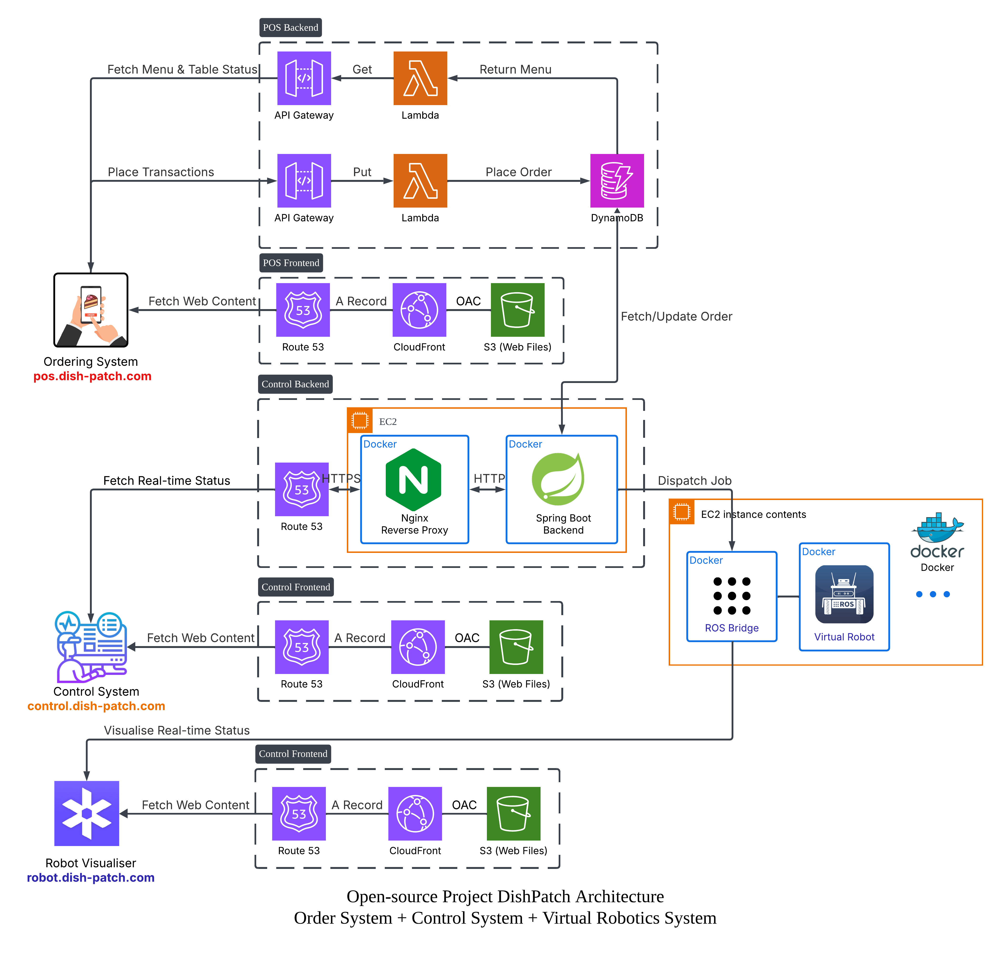

# Architecture

DishPatch is three systems that meet at two points. The **POS** takes orders; the **control
system** turns them into deliveries and shows them to an operator; the **robot fleet** drives.
The POS and the control system meet at a DynamoDB table. The control system and the fleet meet
at a rosbridge WebSocket. Nothing else connects them.

One correction to the diagram: the lowest group — Route 53, CloudFront and S3 serving
`robot.dish-patch.com` — is captioned "Control Frontend". It is the Robot Visualiser's hosting.

| Component | What it is | Where it runs | Address |
|:--|:--|:--|:--|
| POS frontend | React ordering app | S3 + CloudFront | `pos.dish-patch.com` |
| POS backend | Express API | Lambda behind API Gateway | `posapi.dish-patch.com` |
| Control frontend | React operator dashboard | S3 + CloudFront | `control.dish-patch.com` |
| Control backend | Spring Boot: dispatch, telemetry, operator API | Docker on EC2, behind nginx | `controlapi.dish-patch.com` |
| Robot fleet | ROS 2 robots, one shared Nav2 stack, rosbridge | Docker on a second EC2 | `rosbridge.dish-patch.com` |
| Robot Visualiser | Foxglove Studio, unmodified | S3 + CloudFront | `robot.dish-patch.com` |

---

## An order, end to end

1. **The order is written.** The POS frontend posts to `POST /api/order`. The POS backend
   writes one item to the DynamoDB Orders table with `orderStatus: "Preparing"` and emits
   nothing else — no message, no event.
2. **Dispatch finds it.** Once a second, `DispatchService.tick()` in the control backend scans
   the Orders table for `Preparing` orders and takes the oldest by `orderDate`.
3. **A robot is chosen.** Only a robot that is idle *and* parked at the counter can take an
   order, because the counter is where the meal is. The order's table number is looked up as a
   drop point — `T1`–`T18` or `R1`–`R7` on the floor plan.
4. **The goal is sent.** The backend publishes a `PoseStamped` on `/robot{id}/goal_pose`
   through rosbridge, and marks the robot `Serving`.
5. **Nav2 drives.** In the fleet, Nav2's `bt_navigator` picks the goal up from that topic,
   plans a path and replans it about once a second while the controller follows it. The
   simulated driver turns velocity commands into odometry, and each robot reports position,
   speed and battery on `/robot{id}/status` ten times a second.
6. **Arrival is Nav2's call.** The backend watches both the robot's position and Nav2's goal
   status. A drive is over when Nav2 holds no live goal *and* the robot is within 0.6 m of the
   destination — the distance is a check on Nav2's verdict, not a substitute for it.
7. **The meal is served.** The robot waits at the table for five seconds. Dispatch then writes
   `Completed` to the order and sends the robot back to the counter as `Returning`; when it
   arrives it becomes `Waiting`, and can take the next order.
8. **The operator sees all of it.** Throughout, the control backend pushes the fleet to the
   dashboard over STOMP ten times a second, and the order list every four seconds.

Two other things touch the same rows and the same robots. An operator can **cancel** a
`Preparing` order from the dashboard; the robot is taken off the delivery on the next tick. And
the **Robot Visualiser** connects from the browser straight to rosbridge over
`wss://rosbridge.dish-patch.com` to show the raw ROS topics — the paths, costmaps and poses —
without passing through the control backend at all.

The details of each step live with the code that implements it:

| Step | Documented in |
|:--|:--|
| 1 | [docs/api.md](./api.md#pos-backend) |
| 2, 3, 6, 7, cancellation | [Dispatch pipeline](../control-backend/src/main/java/com/dishpatch/dispatch/README.md) |
| 4, 5 | [robot-fleet/README.md](../robot-fleet/README.md) |
| 8 | [docs/api.md](./api.md#websocket-stomp) and [control-frontend/README.md](../control-frontend/README.md#live-data) |

---

## Why the database is the queue

There is no message queue between the POS and the control backend. Pending orders are the rows
whose status is `Preparing`, and sorting them by `orderDate` on every tick is what makes
dispatch first-in, first-out.

That buys three things. There is one source of truth for whether an order is waiting, rather
than a queue and a table that can disagree. Nothing is lost when the control backend restarts:
an order it was delivering is still `Preparing`, so it is dispatched again. And the POS needs no
knowledge of the control system — it writes a row and is done.

The costs are real too. Dispatch learns about an order by polling, so a new order can sit for up
to a second before dispatch sees it. Every poll is a full scan of the Orders table, and the order broadcast to the dashboard
scans it again on its own schedule — about 1.25 scans a second between them, growing with the
table. And because the table is the only interface, **the contract between the two systems is
just the data in it**:

| The POS must write | Because dispatch |
|:--|:--|
| `orderStatus` of exactly `Preparing`, `Completed` or `Cancelled` | selects on `Preparing` and only allows changes out of it |
| `table` naming a drop point, `T1`–`T18` or `R1`–`R7` | uses the table number as the robot's destination, and skips anything it cannot find |
| `orderDate` as an ISO-8601 string | orders the queue by it |

Nothing enforces the contract on the POS side. Its order update accepts any status string, and
its order creation validates nothing — [docs/api.md](./api.md#known-issues) lists the
consequences.

---

## Where state lives

| State | Lives in | Survives a restart of |
|:--|:--|:--|
| Orders, POS users, tables, menus, payments | DynamoDB, five tables created by the POS backend's CloudFormation stack | everything |
| Operator accounts | DynamoDB, the `Users` table, which no template creates — it was made by hand, with an `EmailIndex` | everything |
| Deliveries in flight, which robot holds which order | Memory in the control backend | nothing. After a restart every robot is sent to the counter before it can take an order, and orders still `Preparing` are dispatched again. |
| The fleet's latest positions, speeds and battery levels | Memory in the control backend, refreshed from rosbridge | nothing, and needs nothing: telemetry arrives again within a second |
| Which robots exist | Discovered from rosbridge's topic list every ten seconds | — |
| The dashboard's layout, and who is signed in | The operator's browser, in `localStorage` | everything except clearing the browser |
| The floor plan and drop points | Generated from `map-source/` into each component at build time | — |

---

## Deployment

Six pieces deploy independently, each from its own GitHub Actions workflow, each triggered by
changes to its own folder. A change to `map-source/` redeploys every component that stages the
map.

**Three static sites** — the POS frontend, the control frontend and the visualiser — are each
a CloudFormation stack of a private S3 bucket behind CloudFront. The workflow deploys the stack,
builds the app, syncs it to the bucket and invalidates the cache.

**The POS backend** is a CloudFormation stack too: the five DynamoDB tables, a public bucket
for menu photos, the Lambda function, which runs a container image, and an API Gateway HTTP API
with a custom domain. The workflow pushes the image to ECR and deploys it by digest.

**Two EC2 instances** carry the rest, and neither is described by any template —
`infrastructure-control-backend.yaml` is entirely commented out. Both were set up by hand, and
both are deployed to over SSH:

| | Control instance | Fleet instance |
|:--|:--|:--|
| OS | Amazon Linux | Ubuntu |
| Runs | nginx and the control backend, in Docker | rosbridge, Nav2, the robots and nginx, under Docker Compose |
| TLS | a `certbot/certbot` container, run by `control-nginx/scripts/deploy-production.sh` | host certbot, installed with `apt` |
| Workflow | `deploy-control-backend.yml` | `deploy-robot-fleet.yml` |

The four CloudFormation workflows authenticate to AWS through IAM OIDC, with no stored keys.
The two EC2 workflows use no AWS credentials at all — only an SSH private key held as a
repository secret.

---

## Trust boundaries

Stated here because they follow from the architecture rather than from any one component.

- **The control backend authenticates nothing.** Its API is public at
  `controlapi.dish-patch.com`, including order cancellation, and its STOMP endpoint accepts
  robot telemetry from any client. Login on the dashboard is cosmetic.
  [docs/api.md](./api.md#authentication) has the full list.
- **The backend's link to the fleet is unencrypted.** It connects to rosbridge at
  `ws://15.135.131.146:9090` — the fleet instance's raw IP — not through the TLS endpoint
  browsers use. rosbridge is published directly on that port, and rosbridge has no
  authentication: anything that can reach it can publish a goal to a robot. Whether anything
  besides the control instance can reach it depends on the instance's security group, which is
  configured outside this repository.
- **The POS authenticates but does not authorise.** Any signed-in user can change any order.
- **The POS and the control backend trust each other's writes.** Each acts on whatever the
  other last wrote to an order, with no check of who wrote it.

---

## Constraints worth knowing before changing anything

- **One Nav2 stack serves the whole fleet.** It runs five real-time nodes per robot in one
  container, and on 2026-08-11 that container was already missing its control deadlines with two
  robots. Replanning once a second adds planner load per robot. Measure before adding a third —
  [robot-fleet/README.md](../robot-fleet/README.md#why-nav2-is-one-container) explains how.
- **Every component is a single instance.** There is one control backend, one Nav2 container,
  one rosbridge. Losing the control backend stops dispatch; losing the fleet instance stops
  every robot.
- **Dispatch shares a thread pool with the dashboard.** The scheduled tick runs on the STOMP
  broker's scheduler, so a tick that blocked would freeze the dashboard too.
- **The table is the queue, so the table's size is the cost.** Scans read every order ever
  placed. Nothing archives or deletes them.
